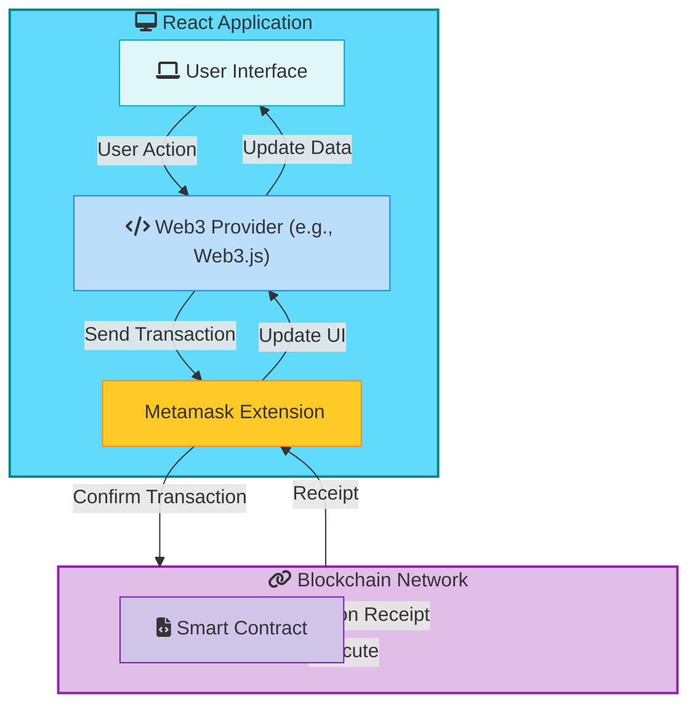
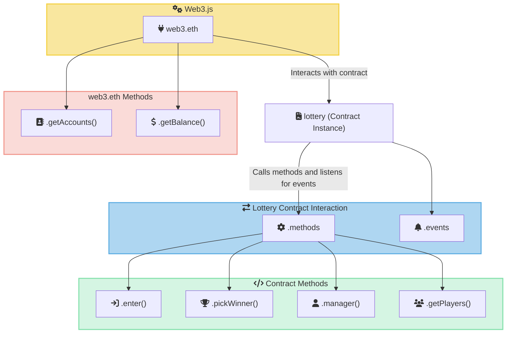
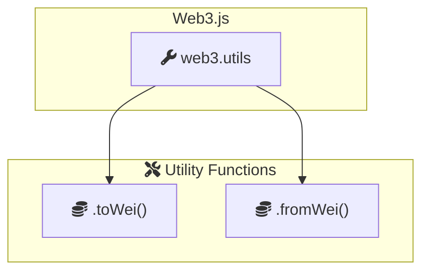

This is a guide to deploying a Lottery smart contract using Truffle and interacting with it using a React frontend. The guide covers setting up a new Truffle project, deploying the contract to a local Ganache blockchain, and connecting a React application to the contract using Web3.js. The Lottery smart contract allows users to enter a lottery by sending a minimum amount of Ether, and the contract owner (manager) can pick a winner randomly from the list of players.

## Deploying a Lottery Smart Contract with Truffle

The Lottery smart contract is a simple Ethereum smart contract that allows users to enter a lottery by sending a minimum amount of Ether. The contract owner (manager) can then pick a winner randomly from the list of players and transfer the contract's balance to the winner.

For more details about the Lottery smart contract, see the previous post on <a href="/posts/lottery-smart-contract-remix"> Blockchain Basics P3 - Lottery Contract: A Beginner’s Guide with Remix and Solidity</a>

### Create a new Truffle project

```bash
truffle init
```

Add this contract to the contracts directory.

```js
// // SPDX-License-Identifier: MIT
pragma solidity ^0.8.0;

contract Lottery {
    address public manager;
    address[] public players;
    uint256 private nonce;

    event WinnerPicked(address winner, uint256 amount);

    constructor() {
        manager = msg.sender;
        nonce = 0;
    }

    function enter() public payable {
        require(msg.value > .1 ether, "Minimum ether required is .1");
        players.push(msg.sender);
    }

    function getRandomNumber(uint256 max) private returns (uint256) {
        nonce++;
        return
            uint256(
                keccak256(
                    abi.encodePacked(
                        block.timestamp,
                        block.difficulty,
                        msg.sender,
                        nonce
                    )
                )
            ) % max;
    }

    function pickWinner() public restricted {
        require(players.length > 0, "No players in the lottery");
        uint256 index = getRandomNumber(players.length);
        address winner = players[index];
        // Transfer the contract balance to the winner
        address payable payableWinner = payable(winner);
        uint256 contractBalance = address(this).balance;
        payableWinner.transfer(contractBalance);
        emit WinnerPicked(winner, contractBalance); // Emit the event
        // Reset the players array for the next round
        players = new address[](0);
    }

    modifier restricted() {
        require(
            msg.sender == manager,
            "Only the manager can call this function"
        );
        _;
    }

    function getPlayers() public view returns (address[] memory) {
        return players;
    }
}
```

Compile And deploy the contract using Truffle.

```bash
truffle compile
```

After compiling the contract, you will see a new build directory in your project with the compiled contract artifacts. The ABI is needed to interact with the contract from your frontend application.

```bash
├── build
│   └── contracts
│       └── Lottery.json
├── contracts
│   └── lottery.sol
├── migrations
├── test
└── truffle-config.js
```

Create a migration file in the migrations directory.

```bash
touch migrations/1_lottery.js
```

```javascript
// migrations/1_lottery.js
var Lottery = artifacts.require("../contracts/Lottery.sol");

module.exports = function(deployer) {
    deployer.deploy(Lottery);
};
```

### Setup Ganache

**Ganache** is a personal blockchain for Ethereum development you can use to deploy contracts, develop your applications, and run tests.  It acts as a simulated Ethereum network on your local machine, allowing you to test your smart contracts and decentralized applications (dApps) without incurring real costs or risking funds on a live network.


For more information, visit the [Ganache website](https://archive.trufflesuite.com/ganache/).

After installing Ganache, start the application and quickly create a new workspace by clicking the "Quickstart" button. This will create a new workspace with 10 accounts, each loaded with 100 fake Ether (ETH).

### Configure Truffle to Connect to Ganache

To connect Truffle to Ganache, you need to update the truffle-config.js file in your project directory. This file contains the configuration settings for your Truffle project, including the network settings for connecting to Ethereum networks.

```javascript
// truffle-config.js
module.exports = {
  networks: {
    development: {
      host: "127.0.0.1",     // Localhost (default: none)
      port: 7545,            // Standard Ethereum port (default: none)
      network_id: "*",       // Any network (default: none)
    },
  },

  compilers: {
    solc: {
      version: "0.8.17",    // Fetch exact version from solc-bin (default: truffle's version)
    }
  },
};

```

### Run migrations

```bash
truffle migrate
```

```bash
1_lottery.js
============

   Replacing 'Lottery'
   -------------------
   > transaction hash:    0x9d928927749b69d59017863f5011c3c0f2b3f28b8298ae681d813adb15c26a40
   > Blocks: 0            Seconds: 0
   > contract address:    0x701C82dAe98F2E44Ea6bE8E2A575Ecb3fCAaA00f
   > block number:        1
   > block timestamp:     1721468086
   > account:             0x5f355E5D0dd0F976D7B451ad7E6a1f0e21Dc3f21
   > balance:             99.99764911675
   > gas used:            696558 (0xaa0ee)
   > gas price:           3.375 gwei
   > value sent:          0 ETH
   > total cost:          0.00235088325 ETH

   > Saving artifacts
   -------------------------------------
   > Total cost:       0.00235088325 ETH

Summary
=======
> Total deployments:   1
> Final cost:          0.00235088325 ETH


```

The contract is deployed by Truffle to the local Ganache blockchain. The contract address is `0x701C82dAe98F2E44Ea6bE8E2A575Ecb3fCAaA00f` and deployed by the account `0x5f355E5D0dd0F976D7B451ad7E6a1f0e21Dc3f21`.


## Use Web3.js to Interact with the Smart Contract

Web3.js is a JavaScript library that allows developers to interact with the Ethereum blockchain. It provides a set of functions and tools to connect to Ethereum nodes, manage accounts, send transactions, and interact with smart contracts. Web3.js can be used with various providers like MetaMask to integrate blockchain functionalities into web applications. It also includes utilities for converting between different units (like Ether and Wei) and handling cryptographic operations.


### Connecting to the Ethereum Provider (MetaMask)



The react application interacts with the Ethereum blockchain through the Web3 provider and the MetaMask extension. The user interface sends transactions to the blockchain, which are confirmed by MetaMask and executed by the smart contract. The transaction receipt is then sent back to the blockchain network and MetaMask, updating the UI with the latest data.


```javascript
// web3.js
import Web3 from "web3";
window.ethereum.request({ method: "eth_requestAccounts" });

const web3 = new Web3(window.ethereum);
```
* **`window.ethereum`:** This object is injected by MetaMask (or another provider) into the browser's global context. It provides the interface for your app to communicate with the Ethereum network.
* **`eth_requestAccounts`:**  This is a request your app sends through `window.ethereum` to ask MetaMask for permission to connect to the user's accounts. MetaMask will prompt the user for approval.
* **`new Web3(window.ethereum)`:** This creates a Web3 instance that uses MetaMask's provider to interact with the blockchain.


###  Interacting with the Smart Contract

```javascript
// lottery.js
import web3 from "./web3";

const address = "...";  // Your deployed contract address
const abi = [...];     // Your contract's ABI (from compilation)

export default new web3.eth.Contract(abi, address);
```
* **`web3.eth.Contract(abi, address)`:** This creates a JavaScript object that represents your deployed smart contract. It uses the ABI to understand the contract's functions and events, and the address to locate it on the blockchain.

* **`address`:** The address where your contract is deployed. You can find this in the Truffle migration output or by checking your Ganache workspace.
* **`abi`:** The ABI (Application Binary Interface) is a JSON array that describes the contract's functions, events, and data structures. You can copy this directly from the Truffle build output `build/contracts/YourContract.json`.


#### Calling Contract Functions





```javascript
// App.js
const manager = await lottery.methods.manager().call(); 
const players = await lottery.methods.getPlayers().call();
await lottery.methods.enter().send({ ... });  // Sending a transaction
await lottery.methods.pickWinner().send({ ... }); 
```

`web3.eth.Contract` provides methods for calling and sending transactions to your smart contract functions.

* **`.call()`:** Used for calling `view` and `pure` functions that don't modify the blockchain state.
* **`.send()`:** Used for calling functions that modify the state (transactions).


### Web3 Utilities



```javascript
web3.utils.toWei(value, "ether");              // Convert ether to wei
web3.utils.fromWei(balance, "ether");          // Convert wei to ether
```

## Running the React Application


**Setup**

1. **Ganache Running:** Make sure Ganache is open and running. You should see several pre-funded accounts listed.
2. **MetaMask Connected:** Ensure MetaMask is installed in your browser and connected to Ganache (as outlined in the previous instructions). The first Ganache account should be your default account in MetaMask.
3. **React App Running:** Start your React lottery application using `npm start`.

**Playing the Lottery**

1. **Enter with Account 1:** In your React app, enter a value (e.g., 0.1 ETH) and click "Enter." This will trigger a transaction from the currently selected MetaMask account (Account 1).
2. **Switch Accounts:** In MetaMask, click on the account icon at the top right. Select another account from the list (e.g., Account 2).
3. **Enter with Account 2:** In your React app, enter a value and click "Enter" again. This will now use Account 2 for the transaction.
4. **Repeat:** Switch to other accounts in MetaMask (Account 3, Account 4, etc.) and repeat the process to enter the lottery with multiple players.

**Picking the Winner**

1. **Switch Back to Owner:** In MetaMask, switch back to the original account you used to deploy the contract (the owner/manager account).
2. **Pick Winner:** In your React app, click the "Pick a winner!" button. This will trigger the `pickWinner` function in your contract, and the winner should be selected (you'll see the event notification and updates in the UI).

**Important Notes:**

* **Gas Costs:** Each time you enter the lottery or pick a winner, a transaction will be sent, incurring gas costs. Ganache provides test ether, so you don't have to worry about real money, but be mindful of gas usage if you're deploying to a real network later.
* **Confirm Transactions:** Make sure you confirm each transaction in MetaMask when prompted.

* **Refreshing the UI:** After each transaction, the UI might not update automatically. Refresh the page to see the latest player count and balance.


### User View


### Manager View With Pick Winner Button

Owning the contract, the manager can pick the winner by clicking the "Pick a winner!".

## Check Winner Event


The winner event is emitted when the winner is picked by the manager.


## References

- [Truffle Suite](https://www.trufflesuite.com/)
- [Tech Spectrum](https://www.youtube.com/watch?v=OIHexEUmUmQ&t) : Deploying a Lottery Smart Contract with Truffle
- [Stephen Grider](https://www.udemy.com/course/ethereum-and-solidity-the-complete-developers-guide/) : Ethereum and Solidity: The Complete Developer's Guide

